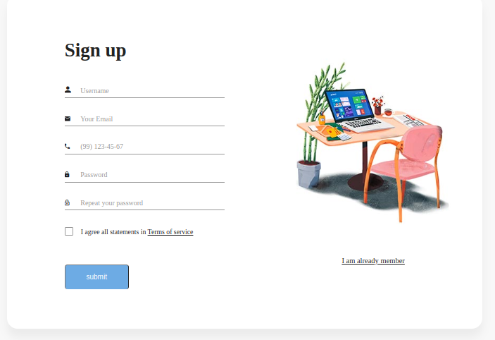
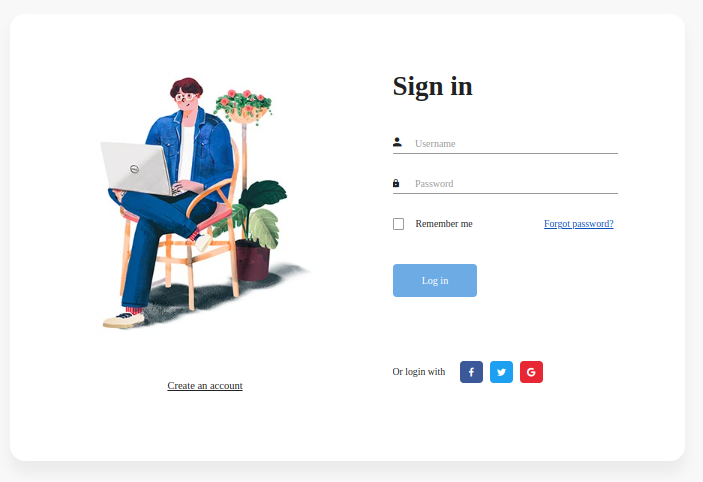
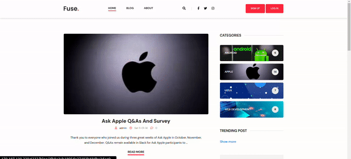
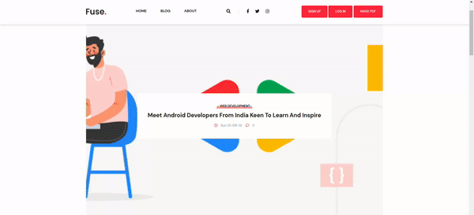
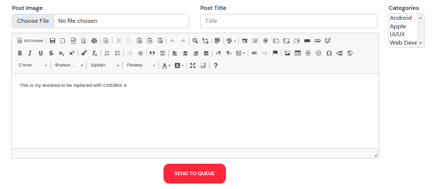
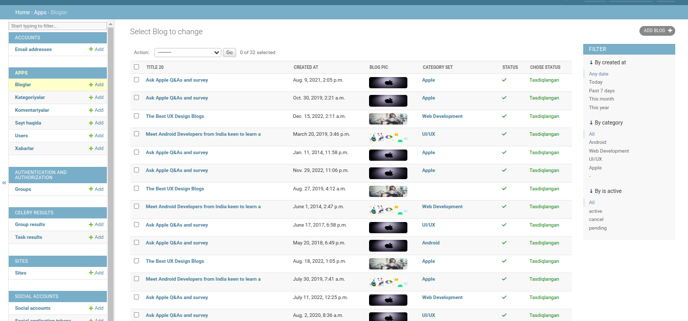

# FUSE BLOG SITE

This is web site that posts news about IT.

## What can FUSE BLOG

It has many features, but here are some of the nicer ones:

* Login and Register
* Login & Register with your Social Account (Google)
* CREATE, UPDATE, DELETE
* Generates PDF version of any post that you want with qr code (it's comments
  included) [pdf](http://170.187.139.229:6232/pdf/abe50d4b9b5dcb583754721a786f4604)
* Generates QR code for blog link
* Trending posts witch viewed the most last month
* Responsive Pangination
* Posts that Canceled more than 7 days ago will be deleted automatically
* and more...

## Installed apps

* Django
* CKEditor
* celery
* Cron
* redis
* PostgreSQl
* Sentery
* Docker

# PAGES
<h3> Register and Login </h3>

<h3> Home </h3>

<h3> Blog </h3>

<h3> Add post </h3>

<h3> Admin Blogs </h3>

<h3> Admin Blog </h3>

